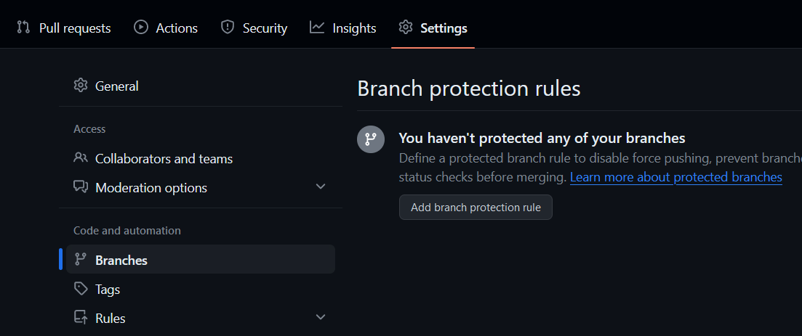

# Assignment: ASSIGNMENT NAME

This repository is compatible with [Replit](https://replit.com/).

[//]: # (TODO: provide a short assignment overview)
Assigment overview goes here... TBD

## Getting started

### Creating a new repository from template

Press the `Use this template` green button at the top.


This will lead you to the repository creation page.
Provide a valid meaningful repo name and add its description.

There is no need to clone branches except `master`. Default branch is always at
the most stable version.

### Protect master branch

It's important not to work within the default branch. So, ensure noone can
commit directly into `master`. In **Settings** navigate to **Branches** under
the **Code and automation** section. Press `Add branch protection rule` button.



Provide branch name pattern and check following options:

- **Require a pull request before merging**
- **Require status checks to pass before merging**
    - **Require branches to be up date before merging**
- **Do not allow bypassing the above settings**


This will protect the default branch from committing directly into it.
You may apply other protection rules, in case of need.

Create a branch protection rule.

## Materials within this repo

There are few major files here.

- `main.py` is the main code base file. It will be used to complete
  the assignment by students.
- `tests` directory is the home of **all** tests provided for the assignment.
- `.lesson` directory is the documentation source
    - `.lesson/instructions.md` is the assignment instructions file visible for
      all.
    - `.lesson/lessonplan.md` is the private file, available only for
      the assignment owners and/or admins.

Other documents may be included into `.lesson` directory.
Only `instructions.md` will be visible for the students.

## Getting started

1. Clone your assignment repo to your local machine.
2. Create a new topic branch (e.g. `feature/assignment`).
3. Complete the assignment instructions. Provide a clear objective and usage
   examples.
4. Prepare the code boilerplate file (`main.py`).
5. Add test cases (use `unittest` framework only).

### Make your boilerplate file invisible for Git

When a boilerplate code is ready, you may want to implement the actual logic
for the assignment. It's useful for running tests especially. However, you do
not want to put the implementation to the assignment repository.

To make changes inside a file invisible for Git use:

```shell
git update-index --assume-unchanged <file>
```

To switch it back:

```shell
git update-index --no-assume-unchanged <file>
```

Always do this while working with non-boilerplate code inside `main.py`.

### Testing

Assignment follows TDD approach. This means all the tests should fail.
Decorate your test cases with `unittest.expectedFailure`. Otherwise, it
will be impossible to merge topic branch into `master.`

[//]: # (TODO: assignment documents)

## Publication checklist

- [ ] Provide assignment name (README and pyproject files).
- [ ] Provide short assignment description (README and pyproject files).
- [ ] Provide assignment instructions, you "assets" directory for static files.
- [ ] Implement test cases within "tests" directory, use `unittest` framework.
